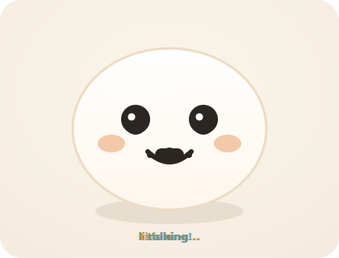
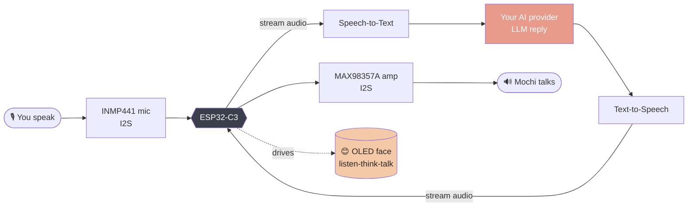

<!-- ════════════════════════════════════════════════════════════════════ -->
<!--                          DASAI MOCHI BOT                              -->
<!-- ════════════════════════════════════════════════════════════════════ -->

<div align="center">

<!-- animated face — loops live on GitHub (SVG + SMIL) -->


<br/>

<!-- animated typing banner (served as an image, so GitHub renders it) -->
<a href="https://github.com/YOUR-USERNAME/dasai-mochi-bot">
  
</a>

<p><b>A tiny ESP32-C3 AI companion.</b> It listens, thinks, and chats using <i>your</i> AI key —<br/>
then pulls goofy faces when you leave it alone. <b>Flash it from your browser. No IDE. No drivers.</b></p>

<!-- shields -->
<p>
  
  
  
  
</p>

<p>
  <a href="https://zero-state-logic.github.io/Dasai-mochi-dextop-buddy/"><b>⚡&nbsp;&nbsp;Flash your Mochi</b></a>
  &nbsp;·&nbsp;
  <a href="#-wiring">🔌&nbsp;Wiring</a>
  &nbsp;·&nbsp;
  <a href="#-how-it-works">🧠&nbsp;How it works</a>
  &nbsp;·&nbsp;
  <a href="#-getting-started">🚀&nbsp;Start</a>
</p>

</div>

---

## 🍡 Meet Mochi

Mochi is a palm-sized robot built around a **Waveshare ESP32-C3-Zero**. Hold the touch
button, ask it anything — the time, the weather, the news, a random question — and it
answers **out loud** through a little speaker. The OLED is its face: it watches you while
listening, gets a thoughtful look while it thinks, and its mouth moves while it talks.

Leave it alone and it just... blinks, glances around, and cycles through silly
expressions to keep you company. There's even a pure **face-toy mode** if you just want
the cuteness without the chatter.

> The face above is the *real* animation logic from the firmware — idle → listening → thinking → talking.

<div align="center">

| 😊 idle | 👀 listening | 💭 thinking | 🗣️ talking |
|:---:|:---:|:---:|:---:|
| blinks & looks around | wide eyes, alert | eyes up, dots | mouth lip-syncs audio |

</div>

---

## ✨ Features

<table>
<tr>
<td width="33%" valign="top">

### 🗣️ Talk & listen
Push-to-talk to ask anything. Speech in, speech out — a real little voice assistant.

</td>
<td width="33%" valign="top">

### 🔑 Your key, your model
Bring **OpenAI, Groq, OpenRouter, Together, or Gemini**. Paste your key, switch any time.

</td>
<td width="33%" valign="top">

### 😜 Silly idle faces
Blinks, gazes, and goofy moods when idle. Toggle a pure face-toy mode.

</td>
</tr>
<tr>
<td valign="top">

### 📡 App-free setup
The bot hosts its **own WiFi page** to enter credentials — like setting up a smart bulb.

</td>
<td valign="top">

### 🔋 Truly portable
LiPo + TP4056 charger + slide switch. A pocket companion that runs off a battery.

</td>
<td valign="top">

### 🛠️ Hackable
One clean Arduino sketch, parameterised faces, swappable pins. Fork it, make it yours.

</td>
</tr>
</table>

---

## 🧠 How it works



Because the ESP32-C3 is a small single-core chip, the heavy lifting — speech-to-text,
the language model, and text-to-speech — runs **on your chosen provider's servers**.
The C3 captures your voice, streams it up, plays the reply back, and animates the face
locally. Setup happens over a captive-portal WiFi page the bot serves itself, so there's
**no app to install**.

---

## 🧩 Hardware

<table>
<tr><th>Part</th><th>Role</th><th>Interface</th></tr>
<tr><td>Waveshare <b>ESP32-C3-Zero</b></td><td>brain + WiFi</td><td>—</td></tr>
<tr><td><b>SSD1306</b> 0.96" OLED</td><td>the face & status</td><td><code>I2C</code></td></tr>
<tr><td><b>INMP441</b> mic</td><td>hears you</td><td><code>I2S in</code></td></tr>
<tr><td><b>MAX98357A</b> + 2W speaker</td><td>talks back</td><td><code>I2S out</code></td></tr>
<tr><td>3× <b>TTP223</b> touch buttons</td><td>talk / next-face / mode</td><td><code>digital</code></td></tr>
<tr><td><b>LiPo + TP4056</b></td><td>portable power</td><td><code>3.7V</code></td></tr>
<tr><td>slide switch</td><td>on / off</td><td>—</td></tr>
</table>

---

## 🔌 Wiring

Everything runs at **3.3V**. Default pins live in [`config.h`](firmware/dasai_mochi_bot/config.h) — easy to change.

<table>
<tr>
<td valign="top">

**OLED (I2C)**
| signal | GPIO |
|---|---|
| SDA | `4` |
| SCL | `5` |

**Mic — INMP441 (I2S)**
| signal | GPIO |
|---|---|
| SCK | `0` |
| WS | `1` |
| SD | `2` |
| L/R | `GND` |

</td>
<td valign="top">

**Speaker — MAX98357A (I2S)**
| signal | GPIO |
|---|---|
| BCLK | `6` |
| LRC | `7` |
| DIN | `8` |
| SD | `3V3` |

**Touch buttons (TTP223)**
| button | GPIO | job |
|---|---|---|
| TALK | `3` | push-to-talk |
| NEXT | `18` | next face |
| MODE | `19` | mode toggle |

</td>
</tr>
</table>

> ⚠️ **Reserved on the C3-Zero — don't use:** `GPIO9` (BOOT), `GPIO10` (onboard RGB LED),
> `GPIO12–17` (onboard flash). The pins above already avoid all of them.
> 👉 **[Interactive pin diagram on the project site →](https://zero-state-logic.github.io/Dasai-mochi-dextop-buddy/#wiring)**

Full step-by-step: **[`hardware/WIRING.md`](hardware/WIRING.md)**

---

## 🚀 Getting started

<table>
<tr>
<td width="50%" valign="top">

### 🙂 For users — no coding

1. Open the **[flash page](https://zero-state-logic.github.io/Dasai-mochi-dextop-buddy/)** in **Chrome / Edge / Opera**.
2. **Hold BOOT** while plugging in USB-C (flash mode).
3. Click **Connect & Flash**, pick the port, confirm.
4. The bot makes a WiFi network: **`DasaiMochi-Setup`**.
5. Join it → a setup page opens → enter WiFi + your AI key. 🍡

</td>
<td width="50%" valign="top">

### 🧑‍💻 For developers

```bash
git clone https://github.com/YOUR-USERNAME/dasai-mochi-bot
cd dasai-mochi-bot

# PlatformIO
pio run            # compile
pio run -t upload  # flash over USB
```
…or open the sketch in **Arduino IDE**
(board: *ESP32C3 Dev Module*).

</td>
</tr>
</table>

---

## 🔑 Getting an API key

<table>
<tr><th>Provider</th><th>Get a key</th><th>Notes</th></tr>
<tr><td><b>Groq</b> ⭐</td><td><code>console.groq.com/keys</code></td><td>fast, generous free tier, Llama 3.x — best default</td></tr>
<tr><td>OpenAI</td><td><code>platform.openai.com/api-keys</code></td><td>GPT models, paid</td></tr>
<tr><td>OpenRouter</td><td><code>openrouter.ai/keys</code></td><td>one key, many models</td></tr>
<tr><td>Together</td><td><code>api.together.xyz</code></td><td>open models, free tier</td></tr>
<tr><td>Gemini</td><td><code>aistudio.google.com/apikey</code></td><td>Google, free tier</td></tr>
</table>

> 🔐 Your key is entered on the **device's own setup page** and stored only in the ESP32's
> flash. It's sent **only** to the provider you chose, over HTTPS. It never touches this repo.

---

## 📁 Project layout

```
dasai-mochi-bot/
├─ firmware/dasai_mochi_bot/    🔧 the Arduino sketch
│  ├─ dasai_mochi_bot.ino       main loop · provisioning · conversation
│  ├─ config.h                  pins & tunables  (edit to rewire)
│  ├─ providers.h               multi-provider LLM table
│  ├─ faces.{h,cpp}             😊 the silly-face engine
│  ├─ llm_client.{h,cpp}        chat + speech-to-text over HTTPS
│  ├─ audio_io.{h,cpp}          I2S mic capture + speaker playback
│  └─ portal_page.h             on-device WiFi/key setup page
├─ docs/                        🌐 GitHub Pages site (flasher + diagram)
│  ├─ index.html                landing · browser flasher · pin diagram
│  ├─ assets/mochi-face.svg     the animated face (also used above)
│  └─ firmware/manifest.json    ESP Web Tools manifest
├─ hardware/WIRING.md           🔌 full wiring guide
├─ platformio.ini
└─ README.md
```

---

## 🗺️ Roadmap

- [ ] Commit the prebuilt `merged.bin` so the web flasher goes live
- [ ] Wake-word ("Hey Mochi") instead of push-to-talk
- [ ] More face moods + per-mood sound effects
- [ ] Battery level shown on the RGB LED
- [ ] 3D-printable shell in `/hardware`

---

## 🙏 Credits

Browser flashing by **[ESP Web Tools](https://esphome.github.io/esp-web-tools/)** (ESPHome / Nabu Casa) ·
animated banner by **[readme-typing-svg](https://github.com/DenverCoder1/readme-typing-svg)** ·
inspired by the open-source **XiaoZhi AI** ESP32 chatbot community.

## 📄 License

**MIT** — see [LICENSE](LICENSE). Build one, fork it, make it weirder.

<div align="center">
<br/>

<br/>
<sub>Built with 🍡 for makers.</sub>
</div>
